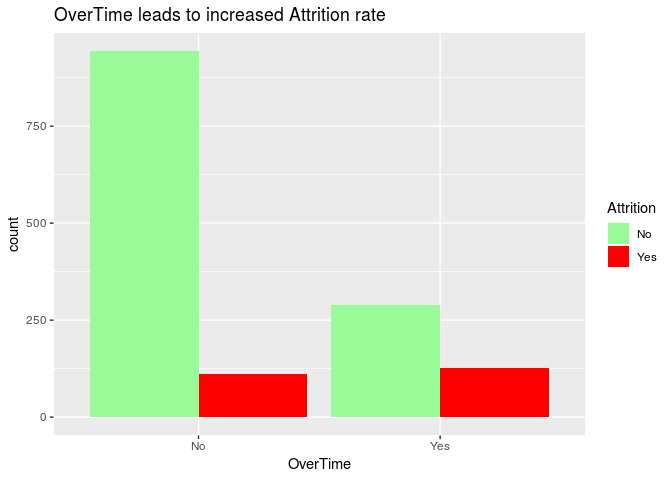
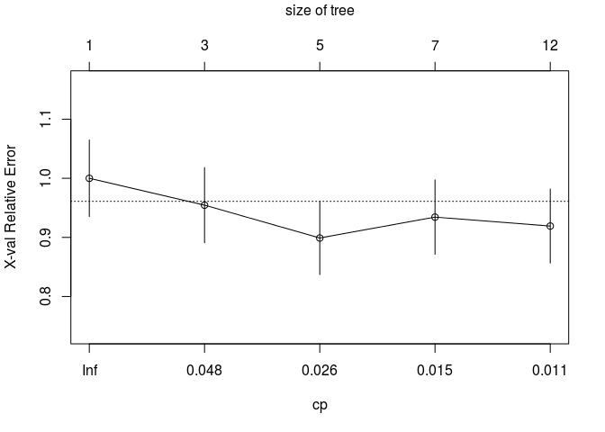

People Analytics Toy Model - Predicting Attrition with Machine Learning Tools
================
Katrin Gemmler
Dec 2nd, 2018

Introduction
============

The following analysis is based on a fictional human resource database (Source: IBM Analytics). In particular the dataset includes information about the employee attrition among various other features for employees of the given fictional company. Goal of the following analysis is to predict employees who are leaving the company and identify the main drivers for their leaving. The analysis leverages several machine learning tools such as logistic regression, 10-fold crossvalidation and tree-based analysis methods including random forest.

1. Load Libraries and Global Settings
=====================================

Load all the additional libraries required, load file containing custom functions and set initial global settings:

``` r
Loadlibraries = function() {
  library(tidyverse)    # for extension from R base, e.g. ggplot
  library(corrplot)     # for correlation plot
  library(ROCR)         # for ROC curve
  library(pROC)         # for AUC
  library(rpart)        # for tree based classification with rpart
  library(rpart.plot)   # for tree plots with rpart
  library(randomForest) # for randomforest 
}
Loadlibraries()
```

    ## ── Attaching packages ─────────────────────────────────────────────────────────────────────────────────────── tidyverse 1.2.1 ──

    ## ✔ ggplot2 3.0.0     ✔ purrr   0.2.5
    ## ✔ tibble  1.4.2     ✔ dplyr   0.7.6
    ## ✔ tidyr   0.8.1     ✔ stringr 1.3.1
    ## ✔ readr   1.1.1     ✔ forcats 0.3.0

    ## ── Conflicts ────────────────────────────────────────────────────────────────────────────────────────── tidyverse_conflicts() ──
    ## ✖ dplyr::filter() masks stats::filter()
    ## ✖ dplyr::lag()    masks stats::lag()

    ## corrplot 0.84 loaded

    ## Loading required package: gplots

    ## KernSmooth 2.23 loaded
    ## Copyright M. P. Wand 1997-2009

    ## 
    ## Attaching package: 'gplots'

    ## The following object is masked from 'package:stats':
    ## 
    ##     lowess

    ## Type 'citation("pROC")' for a citation.

    ## 
    ## Attaching package: 'pROC'

    ## The following objects are masked from 'package:stats':
    ## 
    ##     cov, smooth, var

    ## randomForest 4.6-14

    ## Type rfNews() to see new features/changes/bug fixes.

    ## 
    ## Attaching package: 'randomForest'

    ## The following object is masked from 'package:dplyr':
    ## 
    ##     combine

    ## The following object is masked from 'package:ggplot2':
    ## 
    ##     margin

``` r
# Loading all custom functions
source("src/utils.R")
source("src/kfoldvalidation.R")

# Set seed for random number generator allowing random objects to be reproduced
set.seed(1234)
```

2. Load, Clean and Explore Data
===============================

Load data and check for missing values
--------------------------------------

Load data from file.csv and make sure to capture missing values:

``` r
# Store data in variable tbl (table) and capture data missing values by replacing "" with NA
tbl <- read.csv("data/EmployeeAttrition.csv", header=TRUE, na.strings=c(""))
```

Check the data for missing values:

``` r
# Count missing values
na_count <- rowSums(data.frame(t(colSums(is.na(tbl)))))
#  Report result
cat("There are ", na_count, " missing values in the dataset.")
```

    ## There are  0  missing values in the dataset.

No pre-cleaning due to missing values is required in this dataset.

Derive a first understanding of the data
----------------------------------------

The header names of the data are:

``` r
cat(names(tbl), sep=", ")
```

    ## Age, Attrition, BusinessTravel, DailyRate, Department, DistanceFromHome, Education, EducationField, EmployeeCount, EmployeeNumber, EnvironmentSatisfaction, Gender, HourlyRate, JobInvolvement, JobLevel, JobRole, JobSatisfaction, MaritalStatus, MonthlyIncome, MonthlyRate, NumCompaniesWorked, Over18, OverTime, PercentSalaryHike, PerformanceRating, RelationshipSatisfaction, StandardHours, StockOptionLevel, TotalWorkingYears, TrainingTimesLastYear, WorkLifeBalance, YearsAtCompany, YearsInCurrentRole, YearsSinceLastPromotion, YearsWithCurrManager

The dimension of the data set (rows, columns) is:

``` r
cat(dim(tbl), sep = ", ")
```

    ## 1470, 35

This is how the head of the data looks like:

``` r
print(head(tbl))
```

    ##   Age Attrition    BusinessTravel DailyRate             Department
    ## 1  41       Yes     Travel_Rarely      1102                  Sales
    ## 2  49        No Travel_Frequently       279 Research & Development
    ## 3  37       Yes     Travel_Rarely      1373 Research & Development
    ## 4  33        No Travel_Frequently      1392 Research & Development
    ## 5  27        No     Travel_Rarely       591 Research & Development
    ## 6  32        No Travel_Frequently      1005 Research & Development
    ##   DistanceFromHome Education EducationField EmployeeCount EmployeeNumber
    ## 1                1         2  Life Sciences             1              1
    ## 2                8         1  Life Sciences             1              2
    ## 3                2         2          Other             1              4
    ## 4                3         4  Life Sciences             1              5
    ## 5                2         1        Medical             1              7
    ## 6                2         2  Life Sciences             1              8
    ##   EnvironmentSatisfaction Gender HourlyRate JobInvolvement JobLevel
    ## 1                       2 Female         94              3        2
    ## 2                       3   Male         61              2        2
    ## 3                       4   Male         92              2        1
    ## 4                       4 Female         56              3        1
    ## 5                       1   Male         40              3        1
    ## 6                       4   Male         79              3        1
    ##                 JobRole JobSatisfaction MaritalStatus MonthlyIncome
    ## 1       Sales Executive               4        Single          5993
    ## 2    Research Scientist               2       Married          5130
    ## 3 Laboratory Technician               3        Single          2090
    ## 4    Research Scientist               3       Married          2909
    ## 5 Laboratory Technician               2       Married          3468
    ## 6 Laboratory Technician               4        Single          3068
    ##   MonthlyRate NumCompaniesWorked Over18 OverTime PercentSalaryHike
    ## 1       19479                  8      Y      Yes                11
    ## 2       24907                  1      Y       No                23
    ## 3        2396                  6      Y      Yes                15
    ## 4       23159                  1      Y      Yes                11
    ## 5       16632                  9      Y       No                12
    ## 6       11864                  0      Y       No                13
    ##   PerformanceRating RelationshipSatisfaction StandardHours
    ## 1                 3                        1            80
    ## 2                 4                        4            80
    ## 3                 3                        2            80
    ## 4                 3                        3            80
    ## 5                 3                        4            80
    ## 6                 3                        3            80
    ##   StockOptionLevel TotalWorkingYears TrainingTimesLastYear WorkLifeBalance
    ## 1                0                 8                     0               1
    ## 2                1                10                     3               3
    ## 3                0                 7                     3               3
    ## 4                0                 8                     3               3
    ## 5                1                 6                     3               3
    ## 6                0                 8                     2               2
    ##   YearsAtCompany YearsInCurrentRole YearsSinceLastPromotion
    ## 1              6                  4                       0
    ## 2             10                  7                       1
    ## 3              0                  0                       0
    ## 4              8                  7                       3
    ## 5              2                  2                       2
    ## 6              7                  7                       3
    ##   YearsWithCurrManager
    ## 1                    5
    ## 2                    7
    ## 3                    0
    ## 4                    0
    ## 5                    2
    ## 6                    6

R's summary for the data reads:

``` r
summary(tbl)
```

    ##       Age        Attrition            BusinessTravel   DailyRate     
    ##  Min.   :18.00   No :1233   Non-Travel       : 150   Min.   : 102.0  
    ##  1st Qu.:30.00   Yes: 237   Travel_Frequently: 277   1st Qu.: 465.0  
    ##  Median :36.00              Travel_Rarely    :1043   Median : 802.0  
    ##  Mean   :36.92                                       Mean   : 802.5  
    ##  3rd Qu.:43.00                                       3rd Qu.:1157.0  
    ##  Max.   :60.00                                       Max.   :1499.0  
    ##                                                                      
    ##                   Department  DistanceFromHome   Education    
    ##  Human Resources       : 63   Min.   : 1.000   Min.   :1.000  
    ##  Research & Development:961   1st Qu.: 2.000   1st Qu.:2.000  
    ##  Sales                 :446   Median : 7.000   Median :3.000  
    ##                               Mean   : 9.193   Mean   :2.913  
    ##                               3rd Qu.:14.000   3rd Qu.:4.000  
    ##                               Max.   :29.000   Max.   :5.000  
    ##                                                               
    ##           EducationField EmployeeCount EmployeeNumber  
    ##  Human Resources : 27    Min.   :1     Min.   :   1.0  
    ##  Life Sciences   :606    1st Qu.:1     1st Qu.: 491.2  
    ##  Marketing       :159    Median :1     Median :1020.5  
    ##  Medical         :464    Mean   :1     Mean   :1024.9  
    ##  Other           : 82    3rd Qu.:1     3rd Qu.:1555.8  
    ##  Technical Degree:132    Max.   :1     Max.   :2068.0  
    ##                                                        
    ##  EnvironmentSatisfaction    Gender      HourlyRate     JobInvolvement
    ##  Min.   :1.000           Female:588   Min.   : 30.00   Min.   :1.00  
    ##  1st Qu.:2.000           Male  :882   1st Qu.: 48.00   1st Qu.:2.00  
    ##  Median :3.000                        Median : 66.00   Median :3.00  
    ##  Mean   :2.722                        Mean   : 65.89   Mean   :2.73  
    ##  3rd Qu.:4.000                        3rd Qu.: 83.75   3rd Qu.:3.00  
    ##  Max.   :4.000                        Max.   :100.00   Max.   :4.00  
    ##                                                                      
    ##     JobLevel                          JobRole    JobSatisfaction
    ##  Min.   :1.000   Sales Executive          :326   Min.   :1.000  
    ##  1st Qu.:1.000   Research Scientist       :292   1st Qu.:2.000  
    ##  Median :2.000   Laboratory Technician    :259   Median :3.000  
    ##  Mean   :2.064   Manufacturing Director   :145   Mean   :2.729  
    ##  3rd Qu.:3.000   Healthcare Representative:131   3rd Qu.:4.000  
    ##  Max.   :5.000   Manager                  :102   Max.   :4.000  
    ##                  (Other)                  :215                  
    ##   MaritalStatus MonthlyIncome    MonthlyRate    NumCompaniesWorked
    ##  Divorced:327   Min.   : 1009   Min.   : 2094   Min.   :0.000     
    ##  Married :673   1st Qu.: 2911   1st Qu.: 8047   1st Qu.:1.000     
    ##  Single  :470   Median : 4919   Median :14236   Median :2.000     
    ##                 Mean   : 6503   Mean   :14313   Mean   :2.693     
    ##                 3rd Qu.: 8379   3rd Qu.:20462   3rd Qu.:4.000     
    ##                 Max.   :19999   Max.   :26999   Max.   :9.000     
    ##                                                                   
    ##  Over18   OverTime   PercentSalaryHike PerformanceRating
    ##  Y:1470   No :1054   Min.   :11.00     Min.   :3.000    
    ##           Yes: 416   1st Qu.:12.00     1st Qu.:3.000    
    ##                      Median :14.00     Median :3.000    
    ##                      Mean   :15.21     Mean   :3.154    
    ##                      3rd Qu.:18.00     3rd Qu.:3.000    
    ##                      Max.   :25.00     Max.   :4.000    
    ##                                                         
    ##  RelationshipSatisfaction StandardHours StockOptionLevel TotalWorkingYears
    ##  Min.   :1.000            Min.   :80    Min.   :0.0000   Min.   : 0.00    
    ##  1st Qu.:2.000            1st Qu.:80    1st Qu.:0.0000   1st Qu.: 6.00    
    ##  Median :3.000            Median :80    Median :1.0000   Median :10.00    
    ##  Mean   :2.712            Mean   :80    Mean   :0.7939   Mean   :11.28    
    ##  3rd Qu.:4.000            3rd Qu.:80    3rd Qu.:1.0000   3rd Qu.:15.00    
    ##  Max.   :4.000            Max.   :80    Max.   :3.0000   Max.   :40.00    
    ##                                                                           
    ##  TrainingTimesLastYear WorkLifeBalance YearsAtCompany   YearsInCurrentRole
    ##  Min.   :0.000         Min.   :1.000   Min.   : 0.000   Min.   : 0.000    
    ##  1st Qu.:2.000         1st Qu.:2.000   1st Qu.: 3.000   1st Qu.: 2.000    
    ##  Median :3.000         Median :3.000   Median : 5.000   Median : 3.000    
    ##  Mean   :2.799         Mean   :2.761   Mean   : 7.008   Mean   : 4.229    
    ##  3rd Qu.:3.000         3rd Qu.:3.000   3rd Qu.: 9.000   3rd Qu.: 7.000    
    ##  Max.   :6.000         Max.   :4.000   Max.   :40.000   Max.   :18.000    
    ##                                                                           
    ##  YearsSinceLastPromotion YearsWithCurrManager
    ##  Min.   : 0.000          Min.   : 0.000      
    ##  1st Qu.: 0.000          1st Qu.: 2.000      
    ##  Median : 1.000          Median : 3.000      
    ##  Mean   : 2.188          Mean   : 4.123      
    ##  3rd Qu.: 3.000          3rd Qu.: 7.000      
    ##  Max.   :15.000          Max.   :17.000      
    ## 

Data cleaning
-------------

The features Over18 and StandardHours have all entries which contain the same values. Thus they do not add any information to the data, which will allow to distinguish employees. To this end Over18 and StandardHours are removed from dataset. EmployeeNumber might be interesting in order to trace back the predictions to a particular employee. But for the purposes of statistical analysis EmployeeNumber and EmployeeCount are also removed:

``` r
tbl <- subset(tbl, select = c(-Over18,-StandardHours,-EmployeeCount,-EmployeeNumber))
```

3. Understand Data Correlations
===============================

Correlation heatmap of features
-------------------------------

First we look at standard correlation coefficients associated with a linear relationship of features.

Preprocessing data for correlation plots:

``` r
# Make sure all values have numerical (necessary for corrplot()). Convert categorical entries into numerical ones first. 
tbl.numpart1 <- select_if(tbl, is.numeric)
tbl.fac <- select_if(tbl, is.factor)
tbl.numpart2 <- as.data.frame(sapply(tbl.fac, as.numeric))
tbl.numfull <- cbind(tbl.numpart2,tbl.numpart1)
```

Brief cross-check if data was reattached correctly by looking at dimensions of dataframes before and after modification:

``` r
# Compare if old and new dimensions are matching
cat("The dimensions of the modified and original dataset: \n [",dim(tbl.numfull),"]","[",dim(tbl),"]")
```

    ## The dimensions of the modified and original dataset: 
    ##  [ 1470 31 ] [ 1470 31 ]

Visualize standard correlation between all features:

``` r
corrplot(cor(tbl.numfull), tl.cex = 0.45)
```


Select correlation for Attrition for a closer look:

``` r
corrplot(
  cor(tbl.numfull[1:length(tbl.numfull),])
  [1:length(tbl.numfull),1, drop=FALSE],
  cl.pos='r',
  cl.align.text = 'l',
  cl.cex = 0.5,
  cl.ratio = 2,
  tl.cex = 0.45
)
```


It should be stressed again that the strength of the correlation in some cases might be missleading since only linear correlation is displayed. Thus we move next to some exploratory analysis in order to understand the dataset in more detail.

Exploratory analysis to extract further correlations
----------------------------------------------------

In this section data correlations are visulatized to show relations between selected features.

### Plot 1: Does OverTime affect MonthlyIncome and Age affect Attrition?

``` r
plot1 <- ggplot() + 
  geom_point(data = filter(tbl, Attrition == "No"), 
             mapping = aes(x = Age, y = MonthlyIncome, color = "green")) +
  geom_point(data = filter(tbl, Attrition == "Yes"), 
             mapping = aes(x = Age, y = MonthlyIncome, color = "red")) + 
  scale_colour_manual(values = c("green","red")) +
  xlab("Age") + ylab("MonthlyIncome") + 
  ggtitle("MonthlyIncome and Age affect Attrition") +
  scale_colour_manual(name = 'Attrition', 
                      values = c('green'='green','red'='red'), 
                      labels = c('No','Yes'))
```

    ## Scale for 'colour' is already present. Adding another scale for
    ## 'colour', which will replace the existing scale.

``` r
plot1
```


It is easy to read that employees with low Age and low MonthlyIncome are more prone to Attrition.

### Plot 2: Does OverTime affect Attrition?

``` r
plot2 <- ggplot(data = tbl,aes(x = OverTime, ..count..)) +
  geom_bar(aes(fill = Attrition), position = "dodge") +
  scale_fill_manual(values = c("palegreen","red")) +  
  ggtitle("OverTime leads to increased Attrition rate")
plot2
```



Clearly employees with OverTime are more likely to leave the company.

### Plot 3: Does JobSatisfaction prevent Attrition?

``` r
plot3 <- ggplot() +
  geom_bar(data = tbl, aes(x = JobSatisfaction, y = ..count.., fill = Attrition), position = "fill") + 
  scale_y_continuous(labels = scales::percent) +
  ylab("percent") +
  scale_fill_manual(values = c("palegreen","red")) +
  ggtitle("Increase in JobSatisfaction prevents Attrition")
plot3
```


JobSatisfaction also does seem to play a role. Increasing the JobSatisfaction of employees seems to lead to a lower rate of Attrition.

### Plot 4: Does WorkLifeBalance prevent Attrition?

``` r
plot4 <- ggplot() + 
  geom_bar(data=tbl, aes(x = WorkLifeBalance, y = ..count.., fill = Attrition), position = "fill") +
  scale_y_continuous(labels = scales::percent) +
  scale_fill_manual(values = c("palegreen","red")) + 
  ylab("percent") +
  ggtitle("Very low WorkLifeBalance shows high Attrition")
plot4
```


WorkLifeBalance seems to affect Attrition only for very low rates. There is a less pronounced correlation for this feature.

4. Divide into Training and Test Data
=====================================

In order to carry out further analysis the data needs to be devided into training data and test data. The training data is used to train the statistical models, the test data is used to calculate predictions making use of the pre-trained models. The predictions obtained are then compared to the response which is also part of the test dataset.

``` r
# Split data into with 80% of data for training and 20% data for testing
sample <- sample(c(TRUE, FALSE), nrow(tbl), replace = T, prob = c(0.8,0.2))
train <- tbl[sample, ]
test <- tbl[!sample, ]
```

This devision into to dataset is useful to avoid overfitting of model parameters on one particular dataset. Goal is certainly to keep both errors minimal in both training and test data. However it that parameter tuning when involving the test set can also introduce an additional bias.

5. Warmup: Build Simple Logistic Regression Model
=================================================

We choose a simple logistic regression model to be the first statistical model in order to predict Attrition. This choice is motivated by the fact that we are looking at a classification problem with a binary response (Attrition: Yes/No).

Model A: Simple Logistic Regression Model
-----------------------------------------

The model predictors (OverTime, MonthlyIncome, JobSatisfaction and Age) are motivated by the exploratory analysis shown above. Response of the model is Attrition, which we aim to predict with this model later on.

``` r
# Model A
glm.fit_A <- glm(Attrition ~ OverTime + MonthlyIncome + JobSatisfaction + Age, 
                 data = train, family = binomial)

summary(glm.fit_A)
```

    ## 
    ## Call:
    ## glm(formula = Attrition ~ OverTime + MonthlyIncome + JobSatisfaction + 
    ##     Age, family = binomial, data = train)
    ## 
    ## Deviance Residuals: 
    ##     Min       1Q   Median       3Q      Max  
    ## -1.4606  -0.5936  -0.4456  -0.3001   2.9318  
    ## 
    ## Coefficients:
    ##                   Estimate Std. Error z value Pr(>|z|)    
    ## (Intercept)      4.613e-01  4.027e-01   1.146 0.251914    
    ## OverTimeYes      1.500e+00  1.693e-01   8.858  < 2e-16 ***
    ## MonthlyIncome   -7.479e-05  2.591e-05  -2.887 0.003895 ** 
    ## JobSatisfaction -2.911e-01  7.369e-02  -3.950 7.82e-05 ***
    ## Age             -4.033e-02  1.112e-02  -3.628 0.000286 ***
    ## ---
    ## Signif. codes:  0 '***' 0.001 '**' 0.01 '*' 0.05 '.' 0.1 ' ' 1
    ## 
    ## (Dispersion parameter for binomial family taken to be 1)
    ## 
    ##     Null deviance: 1065.40  on 1173  degrees of freedom
    ## Residual deviance:  933.21  on 1169  degrees of freedom
    ## AIC: 943.21
    ## 
    ## Number of Fisher Scoring iterations: 5

All parameters in Model A are highly statstically significant, indicated by p-value Pr(&gt;|z|) and the stars on the side (see sigificance code above for explanation).

### Understand the statistical background

R chooses Z-statistics as test statistics which assumes a normal distribution with unknown mean and known standard deviation. The null hypothesis corresponds to the data not being dependent on the features X=(OverTime, MonthlyIncome, JobSatisfaction, Age), since the corresponding slope parameter is zero for null hypothesis. The null hypothesis is rejected for p-value &lt; 0.05. In case of rejection the dependence on X is significant for the model.

Predict Attrition with Model A
------------------------------

Next the test data is used to predict Attrition. The relevant features from test data set need to be extracted first:

``` r
dfrmtest_A <- test[, c("OverTime", "MonthlyIncome", "JobSatisfaction", "Age")]
```

Then the prediction for Attrition is calculated with the test dataset using Model A:

``` r
result_A <- predict(glm.fit_A, newdata = dfrmtest_A, type = "response")
```

Predicted values for Attrition (see second row values) are given in terms of probablities:

``` r
head(result_A)
```

    ##          5         14         16         26         28         29 
    ## 0.18709186 0.09337645 0.14860012 0.01839277 0.08907318 0.03755112

Depending on the threshold probabililty prop to be choosen (e.g. in standard setting prop= 0.5) a value &gt; prop indicates a YES and a value &lt; prop indicates a NO.

Comparing these predictions to the actual Attrition of the test data set one can see that the first values are predicted correctly:

``` r
head(test$Attrition)
```

    ## [1] No No No No No No
    ## Levels: No Yes

For a quick assessment of the model performance, we can compute the area under the curve (AUC):

``` r
auc(test$Attrition, result_A)
```

    ## Area under the curve: 0.7757

The AUC originates from the ROC curve, which scans over different shresholds assessing the false positive rate and true positive rate of the prediction. Thus the AUC is threshold independent. When AUC is &gt; 0.5 it indicates that there is a separation capability present in the model. The model is excellent when AUC is close to 1.

6. Refine by Using Extended Logistic Regression Model
=====================================================

The next goal is to improve the separation capability of the simple logistic regression model (Model A) by introducing more features.

Model B: A comprehensive model to identify significant model parameters
-----------------------------------------------------------------------

Model B contains considers features present in the dataset.

``` r
glm.fit_B <- glm(Attrition ~ ., data = train, family = binomial)
```

The idea is to identify all model parameters which are highly statistical significant:

``` r
# Extract model parameters with Pr(>|z|)`<0.01 
temp <- as.data.frame(summary(glm.fit_B)$coefficients)
significantParams <- temp[temp$`Pr(>|z|)`<0.01,]
significantParams
```

    ##                                    Estimate Std. Error   z value
    ## Age                             -0.04124899 0.01543946 -2.671660
    ## BusinessTravelTravel_Frequently  1.56392562 0.44403429  3.522083
    ## DistanceFromHome                 0.04013498 0.01208048  3.322300
    ## EnvironmentSatisfaction         -0.47646395 0.09265432 -5.142382
    ## JobInvolvement                  -0.58118469 0.13358106 -4.350801
    ## JobRoleLaboratory Technician     1.47170425 0.53350442  2.758561
    ## JobSatisfaction                 -0.39092450 0.08918371 -4.383362
    ## MaritalStatusSingle              1.02765923 0.38525549  2.667475
    ## NumCompaniesWorked               0.19602109 0.04387161  4.468063
    ## OverTimeYes                      1.96582466 0.21338511  9.212567
    ## YearsAtCompany                   0.11551797 0.04022021  2.872137
    ## YearsInCurrentRole              -0.14844244 0.04909320 -3.023687
    ## YearsSinceLastPromotion          0.14711318 0.04532097  3.246029
    ## YearsWithCurrManager            -0.15314842 0.05015804 -3.053317
    ##                                     Pr(>|z|)
    ## Age                             7.547711e-03
    ## BusinessTravelTravel_Frequently 4.281701e-04
    ## DistanceFromHome                8.927868e-04
    ## EnvironmentSatisfaction         2.712763e-07
    ## JobInvolvement                  1.356408e-05
    ## JobRoleLaboratory Technician    5.805654e-03
    ## JobSatisfaction                 1.168616e-05
    ## MaritalStatusSingle             7.642367e-03
    ## NumCompaniesWorked              7.893121e-06
    ## OverTimeYes                     3.184172e-20
    ## YearsAtCompany                  4.077059e-03
    ## YearsInCurrentRole              2.497150e-03
    ## YearsSinceLastPromotion         1.170268e-03
    ## YearsWithCurrManager            2.263264e-03

In the next step these significant model parameters are chosen for a refined logistic regression model (Version C). Note that MonthlyIncome is chosen as an additional feature for the refined model since it is one of the few features containing a continuous variable.

Model C: Refined logistic regression model using statistically significant model parameters
-------------------------------------------------------------------------------------------

The refined model then reads:

``` r
glm.fit_C <- glm(Attrition ~ Age +
                   BusinessTravel + 
                   DistanceFromHome +
                   EnvironmentSatisfaction +
                   JobInvolvement + 
                   JobSatisfaction +
                   MaritalStatus + 
                   MonthlyIncome +
                   NumCompaniesWorked +
                   OverTime +  
                   WorkLifeBalance +
                   YearsAtCompany +
                   YearsInCurrentRole +
                   YearsSinceLastPromotion +
                   YearsWithCurrManager,
                 data = train,
                 family = binomial)
```

The output proofs that coefficients of features are statistically significant:

``` r
print(summary(glm.fit_C))
```

    ## 
    ## Call:
    ## glm(formula = Attrition ~ Age + BusinessTravel + DistanceFromHome + 
    ##     EnvironmentSatisfaction + JobInvolvement + JobSatisfaction + 
    ##     MaritalStatus + MonthlyIncome + NumCompaniesWorked + OverTime + 
    ##     WorkLifeBalance + YearsAtCompany + YearsInCurrentRole + YearsSinceLastPromotion + 
    ##     YearsWithCurrManager, family = binomial, data = train)
    ## 
    ## Deviance Residuals: 
    ##     Min       1Q   Median       3Q      Max  
    ## -1.9769  -0.5438  -0.3049  -0.1464   3.2163  
    ## 
    ## Coefficients:
    ##                                   Estimate Std. Error z value Pr(>|z|)    
    ## (Intercept)                      2.4136490  0.8075242   2.989 0.002799 ** 
    ## Age                             -0.0526365  0.0128881  -4.084 4.42e-05 ***
    ## BusinessTravelTravel_Frequently  1.4932222  0.4219395   3.539 0.000402 ***
    ## BusinessTravelTravel_Rarely      0.8725090  0.3920402   2.226 0.026044 *  
    ## DistanceFromHome                 0.0318779  0.0111410   2.861 0.004219 ** 
    ## EnvironmentSatisfaction         -0.4265785  0.0854616  -4.991 5.99e-07 ***
    ## JobInvolvement                  -0.6316549  0.1267489  -4.984 6.24e-07 ***
    ## JobSatisfaction                 -0.3592552  0.0831657  -4.320 1.56e-05 ***
    ## MaritalStatusMarried             0.4998563  0.2759794   1.811 0.070109 .  
    ## MaritalStatusSingle              1.3725718  0.2742862   5.004 5.61e-07 ***
    ## MonthlyIncome                   -0.0001113  0.0000329  -3.385 0.000713 ***
    ## NumCompaniesWorked               0.1662261  0.0390652   4.255 2.09e-05 ***
    ## OverTimeYes                      1.7271826  0.1927240   8.962  < 2e-16 ***
    ## WorkLifeBalance                 -0.2725930  0.1307783  -2.084 0.037125 *  
    ## YearsAtCompany                   0.0801561  0.0354953   2.258 0.023932 *  
    ## YearsInCurrentRole              -0.1309824  0.0454492  -2.882 0.003952 ** 
    ## YearsSinceLastPromotion          0.1407535  0.0426351   3.301 0.000962 ***
    ## YearsWithCurrManager            -0.1421469  0.0471560  -3.014 0.002575 ** 
    ## ---
    ## Signif. codes:  0 '***' 0.001 '**' 0.01 '*' 0.05 '.' 0.1 ' ' 1
    ## 
    ## (Dispersion parameter for binomial family taken to be 1)
    ## 
    ##     Null deviance: 1065.40  on 1173  degrees of freedom
    ## Residual deviance:  773.74  on 1156  degrees of freedom
    ## AIC: 809.74
    ## 
    ## Number of Fisher Scoring iterations: 6

Assess Predictive Performance of Model C
----------------------------------------

As explained above threshold independent model performance can be assessed via calulating the AUC:

``` r
# Extract relevant data from test data set in order to calculate prediction
dfrmtest_C <- test[, c("Age",
                       "BusinessTravel",
                       "DistanceFromHome",
                       "EnvironmentSatisfaction",
                       "JobInvolvement", 
                       "JobSatisfaction",
                       "MaritalStatus", 
                       "MonthlyIncome",
                       "NumCompaniesWorked",
                       "OverTime",
                       "WorkLifeBalance", 
                       "YearsAtCompany",
                       "YearsInCurrentRole",
                       "YearsSinceLastPromotion",
                       "YearsWithCurrManager")]

# Calculate predictions using test data extract
result_C <- predict(glm.fit_C, newdata=dfrmtest_C, type="response")

# Derive area under the ROC curve (AUC), syntax (response, predictor)
auc(test$Attrition, result_C)
```

    ## Area under the curve: 0.8278

The value of Model C is higher compared to the value of Model A and thus indicates improved separation capability for the refined version (Model C).

Next we have a closer look at the ROC curve of Model C is given by true positive rate (sensitivity) over false positive rate (1 - specificity):

``` r
# using function rocplot(pred,truth,...) from file utils.R
rocplot(result_C, 
        test$Attrition,
        colorize=TRUE, 
        print.cutoffs.at=seq(0,1,by=0.1), 
        text.adj=c(-0.2,1.7),
        main="ROC Curve")
```


The ROC curve indicates threshold prop = 0.16 to be a good choice for calculating performance specifics. For this specific threshold confusion matrix, accurarcy, sensitivity and specificity of Model C can be calculated:

``` r
# Use function confusionmatrix(testdata, modelpred, threshold) from file utils.R The function returns the confusion matrix, accuracy, sensitivity and specificity as list
conf <- confusionmatrix(test$Attrition, result_C, 0.16)
```

The confusion matrix given by

``` r
conf[[1]]
```

    ##         
    ## testdata FALSE TRUE
    ##      No    191   66
    ##      Yes    10   29

``` r
cat("Model accuracy is:", format(conf[[2]] * 100, digits=3),"%.\n")
```

    ## Model accuracy is: 74.3 %.

``` r
cat("Model sensitivity is:", format(conf[[3]] * 100, digits=3),"%.\n")
```

    ## Model sensitivity is: 74.4 %.

``` r
cat("Model specificity is:", format(conf[[4]] * 100, digits=3),"%.\n")
```

    ## Model specificity is: 74.3 %.

Note that threshold tuning on the test set can also introduce a bias and has to be applied with care. Overall Model C is capable to identify indiviual employees that are leaving the company.

7. Evaluate Performance Stability with 10-fold Cross-validation
===============================================================

The next step is to evaluate how stable Model C (Refined logistic regression model) performs under different datasets. Since the here data is very limited, such assessment can be performed using k-fold cross-validation. K-fold cross-validation partions data in k-folds and then uses the kth fold as test data set while the remaining folds (excluding the kth fold) are used for training. In total there are k possibilities to assign the test data leading to k different predictive models. This allows to make k predictions and is useful to examine variability of responses. Note that k-fold cross-validation also can be used to reduce variance for the resulting performance estimate by averaging over the k different partitions. For this example 10-fold cross-validation is chosen.

In order to perform 10-fold cross-validation the function kFoldValidation defined in kfoldvalidation.R is used. The function takes the number of folds, data, modelformula and a threshold as inputs, and outputs a list of vectors containing the AUC, accuracy, sensitivity and specificity.

``` r
modelfmla <- Attrition ~ Age +
                        BusinessTravel + 
                        DistanceFromHome +
                        EnvironmentSatisfaction +
                        JobInvolvement + 
                        JobSatisfaction +
                        MaritalStatus + 
                        MonthlyIncome +
                        NumCompaniesWorked +
                        OverTime +  
                        WorkLifeBalance +
                        YearsAtCompany +
                        YearsInCurrentRole +
                        YearsSinceLastPromotion +
                        YearsWithCurrManager

validationresult <- kFoldValidation(10,tbl,modelfmla,0.16)
vector_auc <- validationresult[[1]]
vector_acc <- validationresult[[2]]
vector_sen <- validationresult[[3]]
vector_spe <- validationresult[[4]]
```

Boxplot shows the variability in AUC:

``` r
boxplot(vector_auc, col="green", border="black", horizontal=FALSE, 
        xlab="AUC",  ylim = c(0.65, 0.95), main="AUC in 10 fold CV\n - threshold independent")
```


The mean for the AUC resulting from 10-fold cross-validation is given by:

``` r
cat("Model average AUC is:", mean(vector_auc),"\n")
```

    ## Model average AUC is: 0.8203435

Similarly variability for accuracy, sensitivity and specificity can be displayed for specific threshold (here: prop = 0.16)

``` r
# Reshape results to use for boxplot
res_cv <- c(vector_acc, vector_sen, vector_spe)
category <- c(rep("Accuracy", 10), rep("Sensitivity", 10), rep("Specificity", 10))
category <- factor(category, levels=c("Accuracy", "Sensitivity", "Specificity"))

# Perform boxplot
boxplot(res_cv ~ category, col=c("skyblue2","blue","darkblue"), pch=19, ylim = c(0.65, 0.95),
        main="Model performance stability in 10 fold CV\n - threshold dependent prop=0.16")
```


The corresponding means for threshold prop = 0.16 are given by:

``` r
cat("Model average accuracy (with threshold propobabiltiy = 0.16) is:", mean(vector_acc),"\n")
```

    ## Model average accuracy (with threshold propobabiltiy = 0.16) is: 0.7571429

``` r
cat("Model average sensitivity (with threshold propobabiltiy = 0.16) is:", mean(vector_sen),"\n")
```

    ## Model average sensitivity (with threshold propobabiltiy = 0.16) is: 0.7582356

``` r
cat("Model average specificity (with threshold propobabiltiy = 0.16) is:", mean(vector_spe),"\n")
```

    ## Model average specificity (with threshold propobabiltiy = 0.16) is: 0.7560568

8. Use Tree-based methods
=========================

In this chapter makes use of decision trees to solve the classification problem stated above. The goal of a classifcation tree is to split up data for the features assessed, at each step that best splits are chosen maximizing purity in each node.

Generally decision trees have some advantages over logistic regression: First, trees allow to graphically interpret model drivers. Second, if model features are chose to be not hand-selected, trees can perform implicit feature selection. The trade-off is that tree-algorithms are generally "greedy". This means the best data split is assessed at the particular given step only. The algorithm does not look ahead and choose a data split which would lead to a better classification result in a future step of the tree-building process. Additionally a disadvantage is that considering a single tree is often less robust to changes in the dataset.

Model D: A basic tree-based model with hand-selected features
-------------------------------------------------------------

For this basic hand-selected tree model (Model D), we select the same features chosen in the simple regression (Model A). Note that choosing instead the features of Model C, would not lead to an improved performance. Thus we restrict to the most simple version here:

``` r
rpart.fit_D <- rpart(Attrition ~ OverTime + MonthlyIncome + JobSatisfaction + Age,  data = train, method="class") 
# Note: Instead of rpart() is it also possible to use tree() from the library(tree).
rpart.fit_D
```

    ## n= 1174 
    ## 
    ## node), split, n, loss, yval, (yprob)
    ##       * denotes terminal node
    ## 
    ##  1) root 1174 198 No (0.8313458 0.1686542)  
    ##    2) OverTime=No 842  91 No (0.8919240 0.1080760) *
    ##    3) OverTime=Yes 332 107 No (0.6777108 0.3222892)  
    ##      6) MonthlyIncome>=2475 274  66 No (0.7591241 0.2408759) *
    ##      7) MonthlyIncome< 2475 58  17 Yes (0.2931034 0.7068966)  
    ##       14) Age>=37.5 11   4 No (0.6363636 0.3636364) *
    ##       15) Age< 37.5 47  10 Yes (0.2127660 0.7872340) *

More information can be obtained using R's summary:

``` r
summary(rpart.fit_D)
```

    ## Call:
    ## rpart(formula = Attrition ~ OverTime + MonthlyIncome + JobSatisfaction + 
    ##     Age, data = train, method = "class")
    ##   n= 1174 
    ## 
    ##           CP nsplit rel error    xerror       xstd
    ## 1 0.06060606      0 1.0000000 1.0000000 0.06479750
    ## 2 0.01515152      2 0.8787879 0.9090909 0.06234910
    ## 3 0.01000000      3 0.8636364 0.9343434 0.06304995
    ## 
    ## Variable importance
    ##      OverTime MonthlyIncome           Age 
    ##            45            43            12 
    ## 
    ## Node number 1: 1174 observations,    complexity param=0.06060606
    ##   predicted class=No   expected loss=0.1686542  P(node) =1
    ##     class counts:   976   198
    ##    probabilities: 0.831 0.169 
    ##   left son=2 (842 obs) right son=3 (332 obs)
    ##   Primary splits:
    ##       OverTime        splits as  LR,         improve=21.852660, (0 missing)
    ##       MonthlyIncome   < 2973.5 to the right, improve=13.538960, (0 missing)
    ##       Age             < 31.5   to the right, improve=11.041600, (0 missing)
    ##       JobSatisfaction < 1.5    to the right, improve= 3.664684, (0 missing)
    ## 
    ## Node number 2: 842 observations
    ##   predicted class=No   expected loss=0.108076  P(node) =0.7172061
    ##     class counts:   751    91
    ##    probabilities: 0.892 0.108 
    ## 
    ## Node number 3: 332 observations,    complexity param=0.06060606
    ##   predicted class=No   expected loss=0.3222892  P(node) =0.2827939
    ##     class counts:   225   107
    ##    probabilities: 0.678 0.322 
    ##   left son=6 (274 obs) right son=7 (58 obs)
    ##   Primary splits:
    ##       MonthlyIncome   < 2475   to the right, improve=20.79126, (0 missing)
    ##       Age             < 33.5   to the right, improve=12.75075, (0 missing)
    ##       JobSatisfaction < 3.5    to the right, improve= 2.80753, (0 missing)
    ##   Surrogate splits:
    ##       Age < 21.5   to the right, agree=0.846, adj=0.121, (0 split)
    ## 
    ## Node number 6: 274 observations
    ##   predicted class=No   expected loss=0.2408759  P(node) =0.2333901
    ##     class counts:   208    66
    ##    probabilities: 0.759 0.241 
    ## 
    ## Node number 7: 58 observations,    complexity param=0.01515152
    ##   predicted class=Yes  expected loss=0.2931034  P(node) =0.04940375
    ##     class counts:    17    41
    ##    probabilities: 0.293 0.707 
    ##   left son=14 (11 obs) right son=15 (47 obs)
    ##   Primary splits:
    ##       Age             < 37.5   to the right, improve=3.198893, (0 missing)
    ##       MonthlyIncome   < 2124   to the right, improve=1.480681, (0 missing)
    ##       JobSatisfaction < 2.5    to the right, improve=1.077340, (0 missing)
    ## 
    ## Node number 14: 11 observations
    ##   predicted class=No   expected loss=0.3636364  P(node) =0.009369676
    ##     class counts:     7     4
    ##    probabilities: 0.636 0.364 
    ## 
    ## Node number 15: 47 observations
    ##   predicted class=Yes  expected loss=0.212766  P(node) =0.04003407
    ##     class counts:    10    37
    ##    probabilities: 0.213 0.787

The the graphical interpretation is the following:

``` r
print(prp(rpart.fit_D, fallen.leaves = TRUE, type=4, extra=1, varlen=0, faclen=0, yesno.yshift=-1))
```

 The employer obtain the following about its employees:

1.  People without OverTime are generally less affected from Attrition.

2.  People with OverTime are safer from Attrition if their MonthlyIncome is &gt; 2475 Dollars.

3.  People with lower MonthlyIncome (&lt; 2475 dollars) and with Age &lt; 38 belong to the riskgroup for Attrition.

Note that some of these results where already indicated by the initial exploratory analysis e.g. in plot 1 and 2.

Next we derive the prediction for Mdoel D:

``` r
# Testdata selection is analogue to model A since same features where chosen
dfrmtest_D <- dfrmtest_A
# Calculate prediction
result_D <- predict(rpart.fit_D, dfrmtest_D)
head(result_D)
```

    ##          No      Yes
    ## 5  0.891924 0.108076
    ## 14 0.891924 0.108076
    ## 16 0.891924 0.108076
    ## 26 0.891924 0.108076
    ## 28 0.891924 0.108076
    ## 29 0.891924 0.108076

The result contains probabilities for the predicted responses for Attrition.

The AUC of Model D is given by:

``` r
auc(test$Attrition, result_D[,'Yes'])
```

    ## Area under the curve: 0.6502

This is a relative poor results compared to the predictivity we obtained using logistic regression.

The final prediction depends on the threshold chosen (just as above in the logistic regression models). Standard would be a threshold of prop = 0.5. But in order to make analysis more comparable to the previously considered regression model, a similar threshold is chosen here (prop = 0.16). The confusion matrix then reads:

``` r
confusionmatrix(test$Attrition, result_D[,'Yes'], 0.16)[[1]]
```

    ##         
    ## testdata FALSE TRUE
    ##      No    193   64
    ##      Yes    19   20

Model E: A comprehensive tree with implicite feature selection
--------------------------------------------------------------

Next we want to make use of implicite feature selection. Thus model features are not pre-assigned by hand. We start with the most general decision tree model for this dataset by including all features. Later we continue by pruning the tree to an optimal size in order to avoid overfitting of the data.

The most general tree classification model reads:

``` r
rpart.fit_E <- rpart(Attrition ~., data = train, method ="class")
rpart.fit_E
```

    ## n= 1174 
    ## 
    ## node), split, n, loss, yval, (yprob)
    ##       * denotes terminal node
    ## 
    ##   1) root 1174 198 No (0.83134583 0.16865417)  
    ##     2) OverTime=No 842  91 No (0.89192399 0.10807601)  
    ##       4) TotalWorkingYears>=1.5 790  73 No (0.90759494 0.09240506) *
    ##       5) TotalWorkingYears< 1.5 52  18 No (0.65384615 0.34615385)  
    ##        10) HourlyRate>=58.5 33   6 No (0.81818182 0.18181818) *
    ##        11) HourlyRate< 58.5 19   7 Yes (0.36842105 0.63157895) *
    ##     3) OverTime=Yes 332 107 No (0.67771084 0.32228916)  
    ##       6) MonthlyIncome>=2475 274  66 No (0.75912409 0.24087591)  
    ##        12) StockOptionLevel>=0.5 158  20 No (0.87341772 0.12658228) *
    ##        13) StockOptionLevel< 0.5 116  46 No (0.60344828 0.39655172)  
    ##          26) JobRole=Healthcare Representative,Human Resources,Manager,Manufacturing Director,Research Director,Research Scientist 67  14 No (0.79104478 0.20895522) *
    ##          27) JobRole=Laboratory Technician,Sales Executive,Sales Representative 49  17 Yes (0.34693878 0.65306122)  
    ##            54) MonthlyIncome< 8163.5 38  17 Yes (0.44736842 0.55263158)  
    ##             108) MonthlyRate< 17091 23   9 No (0.60869565 0.39130435)  
    ##               216) DistanceFromHome< 4.5 13   2 No (0.84615385 0.15384615) *
    ##               217) DistanceFromHome>=4.5 10   3 Yes (0.30000000 0.70000000) *
    ##             109) MonthlyRate>=17091 15   3 Yes (0.20000000 0.80000000) *
    ##            55) MonthlyIncome>=8163.5 11   0 Yes (0.00000000 1.00000000) *
    ##       7) MonthlyIncome< 2475 58  17 Yes (0.29310345 0.70689655)  
    ##        14) DailyRate>=975.5 23  11 No (0.52173913 0.47826087)  
    ##          28) YearsInCurrentRole>=2.5 7   0 No (1.00000000 0.00000000) *
    ##          29) YearsInCurrentRole< 2.5 16   5 Yes (0.31250000 0.68750000) *
    ##        15) DailyRate< 975.5 35   5 Yes (0.14285714 0.85714286) *

For better overview it is nice to visualiye the tree for Model E before pruning:

``` r
print(prp(rpart.fit_E, fallen.leaves = TRUE, type=4, extra=1, varlen=0, faclen=0, yesno.yshift=-1))
```


The next step is to use the complexity parameter (cp) to control the size of the classification tree. The optimal tree size is achieved when the cost of adding another feature to the decision tree from the current node is above the value of cp. In this case the tree building process is not continued.

The values for the complexity parameter read:

``` r
printcp(rpart.fit_E)
```

    ## 
    ## Classification tree:
    ## rpart(formula = Attrition ~ ., data = train, method = "class")
    ## 
    ## Variables actually used in tree construction:
    ##  [1] DailyRate          DistanceFromHome   HourlyRate        
    ##  [4] JobRole            MonthlyIncome      MonthlyRate       
    ##  [7] OverTime           StockOptionLevel   TotalWorkingYears 
    ## [10] YearsInCurrentRole
    ## 
    ## Root node error: 198/1174 = 0.16865
    ## 
    ## n= 1174 
    ## 
    ##         CP nsplit rel error  xerror     xstd
    ## 1 0.060606      0   1.00000 1.00000 0.064798
    ## 2 0.037879      2   0.87879 0.95455 0.063599
    ## 3 0.017677      4   0.80303 0.89899 0.062064
    ## 4 0.012626      6   0.76768 0.93434 0.063050
    ## 5 0.010000     11   0.69697 0.91919 0.062631

xerror is the cross-validation error (rpart has already a built-in cross validation).

The xerror can be shown as a function of the complexity parameter:

``` r
print(plotcp(rpart.fit_E))
```



Generally for pruning one chooses a small tree with the least cross validated error:

``` r
prune.rpart.fit_E <- prune(rpart.fit_E, cp= rpart.fit_E$cptable[which.min(rpart.fit_E$cptable[,"xerror"]),"CP"])
```

The pruned tree (Model E) looks then like:

``` r
print(prp(prune.rpart.fit_E, fallen.leaves = TRUE, type=4, extra=1, varlen=0, faclen=0, yesno.yshift=-1))
```


OverTime and MonthlyIncome appear automatically as some of the most important decision features. Note that those features we have already chosen in simple tree of Model D.

Use test data to make prediction:

``` r
dfrmtest_E <- test
result_E <- predict(rpart.fit_E, dfrmtest_E)
```

The AUC of model E is given by:

``` r
auc(test$Attrition, result_E[,'Yes'])
```

    ## Area under the curve: 0.7241

The model predictivity is improved significantly compared to simple tree (Model D) but cannot reach predictivity of logistic regression.

Confusion matrix for Model E (with threshold chosen to be prop = 0.16) is given by:

``` r
confusionmatrix(test$Attrition, result_E[,'Yes'], 0.16)[[1]]
```

    ##         
    ## testdata FALSE TRUE
    ##      No    229   28
    ##      Yes    22   17

9. Improve Tree-based Prediction through Random Forest
======================================================

The predictive performance of decision trees can be improved significantly by aggregating multiple decision trees. Common methods are bagging, random forests, and boosting. The analysis here restricts on random forest. Random forest uses bootstrap aggregation just like bagging, but extends bagging with additional a variable (and random) feature selection. Random forest helps to reduce the variance compared to a single decision tree. Random forest can also handle dataset with high dimensions well.

Model F: General Random Forest model
------------------------------------

The most general random forest model is given by:

``` r
rf.fit_F <- randomForest(Attrition ~.,  
                        data = train, replace=TRUE, importance=TRUE, do.trace=4, ntree=100)
```

Note that the feature selection (mytry) is set to default (close to squareroot of total number of features), which leads to a good fit in this case.

Visualize reduced out-of-bag error through training on trees:

``` r
plot(rf.fit_F$err.rate[,'OOB'],  xlab = "index", ylab = "OOB Error")
```


Next we assess the importance of the different features:

``` r
varImpPlot(rf.fit_F, main="Importance of features for Attrition prediction with RandomForest", n.var=10)
```


Next we make the prediction using the test dataset:

``` r
result_F <- predict(rf.fit_F, test)
result_prob_F <- predict(rf.fit_F, test, type = "prob")
```

We specify output depending on the desired result:

``` r
head(result_F)
```

    ##  5 14 16 26 28 29 
    ## No No No No No No 
    ## Levels: No Yes

``` r
head(result_prob_F)
```

    ##      No  Yes
    ## 5  0.78 0.22
    ## 14 0.92 0.08
    ## 16 0.93 0.07
    ## 26 0.98 0.02
    ## 28 0.92 0.08
    ## 29 0.81 0.19

The AUC for the random forest model (Model F) reads:

``` r
auc(test$Attrition, result_prob_F[,'Yes'])
```

    ## Area under the curve: 0.8285

This is a quiet good performance and in the same ballpark the best regression model.

Summary and Outlook
===================

Summarizing Results and Recommendations
---------------------------------------

In this analysis we predicted Attrition for employees of a fictional HR database leveraging Machine Learning Tools.

First we solved this classification problem via logistic regression. By pre-selecting only statistically sigificant coefficients we could come up with a refined logistic regression model (Model C) where the AUC is given by

``` r
auc(test$Attrition, result_C)
```

    ## Area under the curve: 0.8278

The model has predictive capability to identify indiviual employees that are leaving the company. Further we determined via 10-fold crossvalidation that the model is relatively stable for changes on the dataset.

The most important model drivers (significance &gt; 0.001) have been identified as: Age, BusinessTravelTravel, EnvironmentSatisfaction, JobInvolvement, JobSatisfaction, MaritalStatus, MonthlyIncome, NumCompaniesWorked, TimeYes and YearsSinceLastPromotion

Next we assessed the classification problem using tree-based methods. In this case model features can be implicitly selected without preassessing the data. Best results were obtained using random forest (Model F) with predictabilty comparable to the logistic regression model. In particular the AUC reads

``` r
auc(test$Attrition, result_prob_F[,'Yes'])
```

    ## Area under the curve: 0.8285

Top 10 model drivers could be either be selected by highest MeanDecreaseAccuracy or MeanDecreaseGini.

``` r
fff <- as.data.frame(rf.fit_F$importance)
cat("Gini Drivers: \n", row.names(fff[order(fff$MeanDecreaseGini, decreasing= T),])[1:10], sep ="\n")
```

    ## Gini Drivers: 
    ## 
    ## MonthlyIncome
    ## Age
    ## OverTime
    ## JobRole
    ## DailyRate
    ## MonthlyRate
    ## TotalWorkingYears
    ## HourlyRate
    ## DistanceFromHome
    ## YearsAtCompany

``` r
cat("\n")
```

``` r
cat("Accuracy Drivers: \n", row.names(fff[order(fff$MeanDecreaseAccuracy, decreasing= T),])[1:10], sep ="\n")
```

    ## Accuracy Drivers: 
    ## 
    ## OverTime
    ## Age
    ## TotalWorkingYears
    ## JobRole
    ## MonthlyIncome
    ## StockOptionLevel
    ## MaritalStatus
    ## JobLevel
    ## YearsAtCompany
    ## EducationField

The employer can use information about risk target groups (see tree plots related to tree-based Model D and E) as well as stated above model drivers to improve retention of highly valued employees.

Next Steps Towards a Real People Analytics Software
---------------------------------------------------

1.  Refine machine learning techniques

-   Optimize parameters of assessed models

-   Try other machine learning techiques e.g. neural networks

1.  Improvement of content:

-   Use a more HR data base with more features and data

-   Create more predictions e.g. predict employer performance

1.  Improvement of frontend to make a usable model

-   Create an interface for clients to upload data

-   Create an automated output for clients e.g. dashboard output
